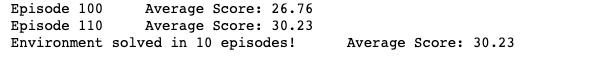

# Report
Deep Deterministic Policy Gradient (DDPG), An actor/cretic algorithm is being use here.
Both the actor and critic is compose of a local network and a target network. The actor is being used to estimate the best action and the critic then uses that value as in a DDQN to evaluate the optimal action value.

Both the actor and critic is composed of 3 fc units:

## Actor -
- fc1 (input = 33, output = 128)
- fc2 (input = 128, output = 128)
- fc3 (input = 128, output = 4)

## Critic - 
- fc1 (input = 33, output = 128)
- fc2 (input = 128, output = 128)
- fc3 (input = 128, output = 1)

The agent is being trained based on the following learning parameters.
- Replay buffer size for experience replay: 1e5
- Batch size of: 128
- Discount factor Gamma as: 0.99
- Soft update value of: 1e-3
- Learning rate (actor): 1e-3
- Learning rate (critic): 1e-3
- Weight decay = 0

## Reward plot
The environment were solved in 25 episodes.

Rewards Graph

## Future ideas
Implementing other models such as PPO, A3C, D4PG will be a good idea for learning purpose and to compare the performance.
As well as implementation to solve Crawler environment.